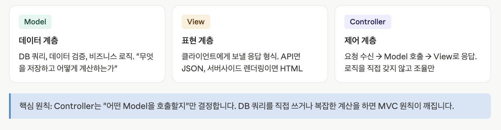
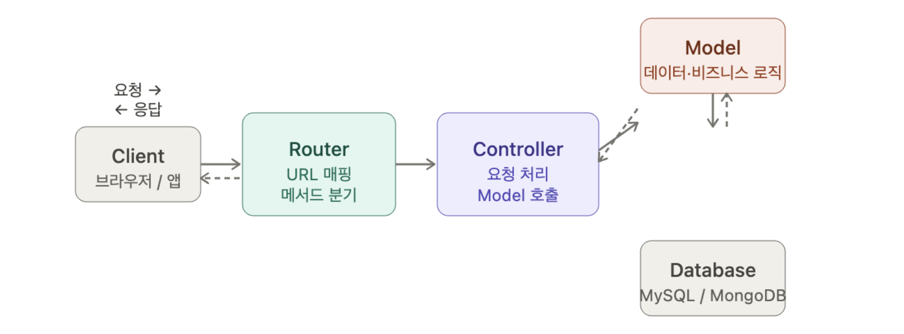

## 1. MVC Pattern

### (1) 개요

- Express 앱이 커질수록 코드 분리가 필요합니다. Router로 경로를 묶고, MVC로 역할을 나눕니다.





### (2) MVC 패턴 적용 실습 예제 :: Dwitter

1️⃣ App.js

```
import express from 'express';
import dwitterRouter from './routes/dwitterRouter.js';

const app = express();
app.use('/dwitter', dwitterRouter);

app.listen(8080, function(){
  console.log("server start~!!");
});
```

2️⃣ routes/dwitterRouter.js

```
import express from 'express';
import * as dwitterController from '../controller/dwitterController.js';

const router = express.Router();

router.use(express.json());
router.use(express.urlencoded());

// 1. GET: /dwitter - All Dwitter List
router.get('/', dwitterController.getAll);

// 2. POST: /dwitter - tweet create
router.post('/', dwitterController.create);

// 3. GET: /dwitter/:id - My Dwitter List
router.get('/:id', dwitterController.getDwitter);

// 4. PUT: /dwitter/:id - My Dwitter update
router.put('/', dwitterController.update);

// 5. DELETE: /dwitter/:id - My Dwitter delete
router.delete('/', dwitterController.remove);

export default router;

```

3️⃣ controller/dwitterController.js

```
import * as dwitterRepository from '../repository/dwitterRepository.js';
import ejs from 'ejs';

/** getAll  **/
export async function getAll(req, res){
  const rows = await dwitterRepository.getAll();
  ejs
    .renderFile('./template/index.ejs', {list:rows})
    .then((data) => {
      console.log(data);
      res.end(data); });
}

/** create */
export async function create(req, res) {
  const {id, name, content} = req.body;
  const result = await dwitterRepository.create(id, name, content);
  if(result === 'success')  res.redirect('/dwitter');
}

/** getDwitter */
export async function getDwitter(req, res) {
  const id = req.params.id;
  const rows = await dwitterRepository.getDwitter(id);
  ejs
    .renderFile('./template/index.ejs', {list:rows})
    .then((data) => res.end(data));

}

/** update */
export async function update(req, res) {
  const {id, content} = req.body;
  const result = await dwitterRepository.update(id, content);
  if(result === 'success')  res.status(204).send('update success!!');
}
/** remove */
export async function remove(req, res) {
  const {id} = req.body;
  const result = await dwitterRepository.remove(id);
  if(result === 'success') res.status(204).send('delete success!');
 }
```

4️⃣ repository/dwitterRepository.js

```
import { db } from '../db/database.js';

export async function getAll(){
  return db
  .execute('select id, name, left(date,10) as date, content from dwitter')
  .then((result) => result[0] );
}

export async function create(id, name, content){
  return db
  .execute('insert into dwitter(id,name,date,content) values(?,?,curdate(),?)',[id,name,content])
  .then((result) => 'success');
}

export async function getDwitter(id){
  return db
  .execute('select id,name,left(date,10) as date, content from dwitter where id=?', [id])
  .then((result) => result[0]);
}

export async function update(id, content){
  return db
  .execute('update dwitter set content=? where id=?',[content, id])
  .then((result) => 'success');
}

export async function remove(id){
  return db
  .execute('delete from dwitter where id=?', [id])
  .then((result) => 'success');
}

```
