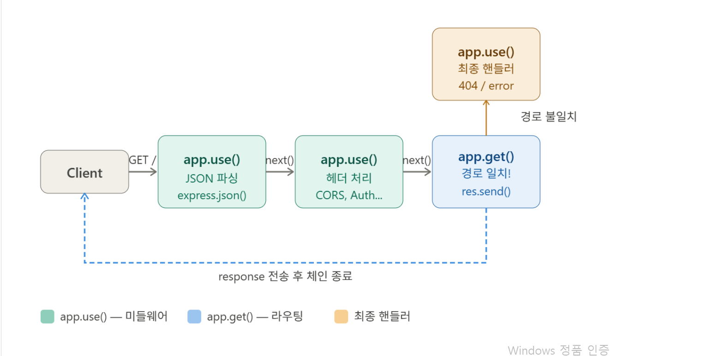

## 1. Express 소개

#### (1) Express 패키지 설치

```
서버 폴더 생성.
 mkdir node-server

폴더 초기화
    cd node-server
    npm init -yes
express 설치
    npm i express
    npm i nodemon -save-dev

package.json 확인
type을 모듈로 수정
script에 start:nodemon app 추가

```

##### 1) 라우팅이란?

```
클라이언트가 특정 URI(엔드포인트)로 요청을 보내면, 서버거 그 요청을 받아서 처리하는 방식을 정의하는 것이다.

예) http://localhost:8080/list  --> /list 요청에 따른 라우팅 진행
```

##### 2) 라우팅 정의

```
1️⃣ express 모듈 import 및 생성
    예) const express = require('express');
        const app = express();

2️⃣ app 객체의 메서드로 HTTP 요청을 라우팅함
    예) app.get()       # R(Read)
        app.post()      # C(Create)
        app.put()       # U(Update)
        app.delete()    # D(Delete)

3️⃣ 라우팅 콜백 함수 정의
    (형식) app.get(경로, 콜백함수)
    예) app.get('/test', function(req, res, next()){
            res.send(...)
        })

    예) app.get('/test/:id', function(req, res, next()){
            res.send(...)
        })

4️⃣ express 서버 시작
    (형식) app.listen(포트번호, 콜백함수)
    예) app.listen(8080)
```

##### 3) 라우팅 정의 실습 코드

```
//모듈 호출 및 인스턴스 생성
const express = require('express')
const app = express()


//데이터 요청(R)
app.get('/get', function(req, res, next) {
			res.send(...)
})

//데이터 생성(C)
app.post('/post', function(req, res, next) {
			res.send(...)
})

//데이터 수정(U)
app.put('/put', function(req, res, next) {
			res.send(...)
})

//데이터 삭제(D)
app.delete('/delete', function(req, res, next) {
			res.send(...)
})


//서버 실행
app.listen(8080)
```

#### (4) Express 미들웨어(Middleware)

##### 1) 미들웨어 체인 흐름



##### 2) 핵심 개념

```
🎯 미들웨어는 요청(Request)과 응답(Response) 사이에서 실행되는 함수입니다.

클라이언트 요청 → [미들웨어1] → [미들웨어2] → [미들웨어3] → 라우터 → 클라이언트

next()를 호출해야 다음 미들웨어로 넘어갑니다.

🎯 기본 구조
    app.use((req, res, next) => {
    // 처리 로직
    next(); // 다음 미들웨어로 전달
    });
```
